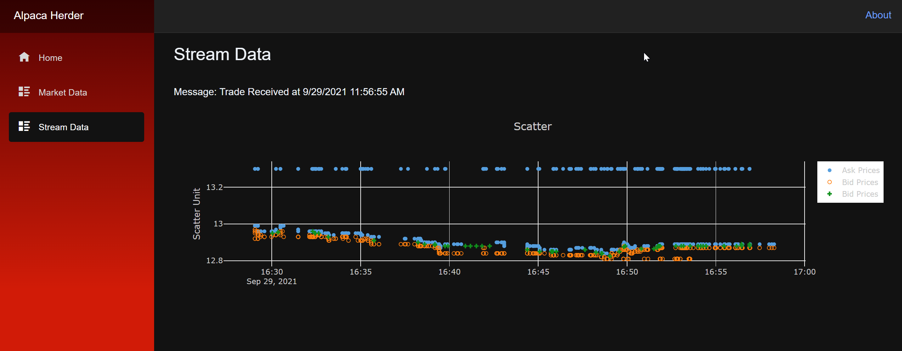
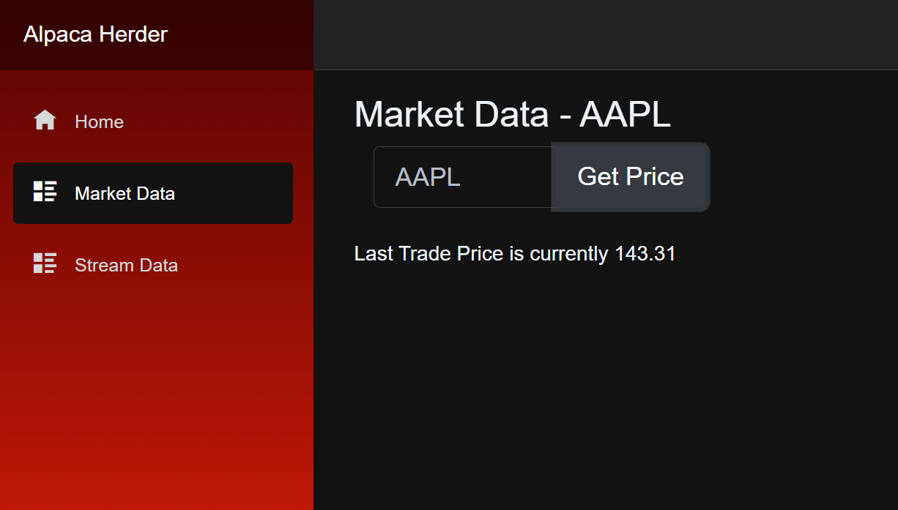

# Alpaca Herder
A .NET 8 Blazor Web App interacting with the Alapaca Markets data api.  This utilizes the latest .NET 8 Auto Interactivity mode allowing the developer to decide to have the page render with WebAssembly on the client or be served to the client from the server. Also offers streaming data capabilties so initial page loads are very fast while the data itself can take the appropriate time needed.

## Startup
The project utilizes .NET Aspire to host and run the application locally. To learn more visit: [dotnet/aspire/get-started/aspire-overview](https://learn.microsoft.com/en-us/dotnet/aspire/get-started/aspire-overview)

## Streaming Data
Handles listening to streaming data from Alpaca Markets and displays to the screen.  This incudes ask, bid and trade prices for a single asset (ticker symbol).  This is handled by using a SignalR hub connection in order to demonstrate using SignalR Hub connections to stream data to the client without any requests from the client. The page uses InteractiveWebAssembly rendering mode.

## Market Data
Handles taking requests for specific trading symbols and displaying the last trade price. This utilizes a standard http rest request to the server api which then in turn requests data from Alpaca Markets. The page uses InteractiveWebAssembly rendering mode.

